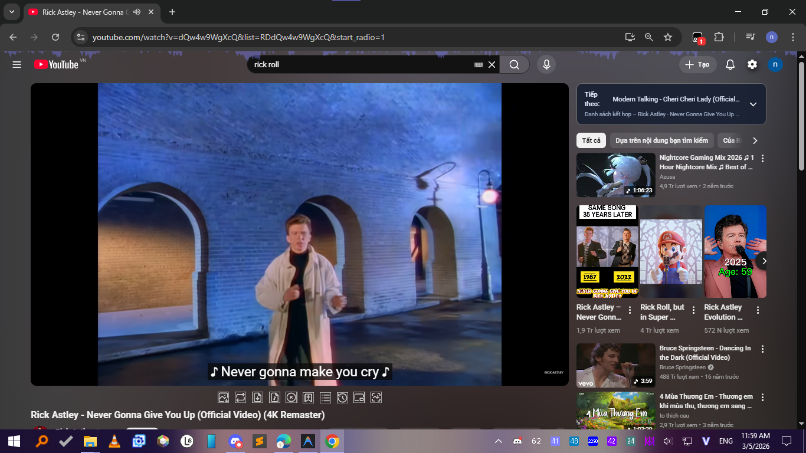
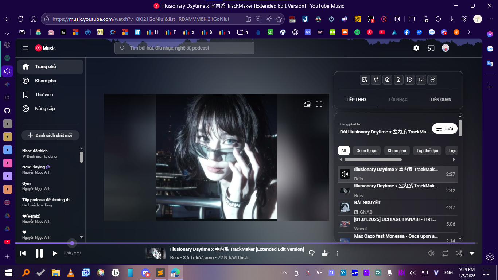

# YouTube Ultimate Tools 🚀

[](https://greasyfork.org/scripts/576162)
[](https://www.gnu.org/licenses/gpl-3.0)
[](https://github.com/akari310/youtube-tools)

A powerful, modular, and glassmorphic userscript designed to elevate your **YouTube** and **YouTube Music** experience with premium features and a modern aesthetic.

---

## 📸 Previews

<div align="center">
  
  
  <p><i>Modern Glassmorphic UI & Advanced Features for YouTube & YT Music</i></p>
</div>

---

## ✨ Key Features

### 📺 YouTube Enhancements
- **🚀 High-Quality Downloads**: Download videos up to **4K/8K** (MP4) and high-fidelity audio (MP3/FLAC).
- **👎 Return YouTube Dislikes**: Restore the public dislike count with real-time synchronization.
- **🎬 Cinema & Ambient Mode**: Immersive viewing with dynamic background lighting and glassmorphic panels.
- **📱 Smart Tools**: Picture-in-Picture mode, instant screenshots, and floating controls.
- **🌐 Comment Translator**: Translate comments instantly using integrated Google Translate.

### 🎵 YouTube Music (YTM) Specialized
- **🔮 Glassmorphic UI**: A complete visual overhaul with beautiful blur effects and sleek typography.
- **🌈 Advanced Ambient Mode**: Dynamic aura effects that sync perfectly with album art colors.
- **☕ Nonstop Playback**: Automatically bypasses "Continue watching?" prompts for uninterrupted listening.
- **🎧 Audio-only Mode**: Toggle video off to save bandwidth and focus purely on the music.

---

## 🚀 Quick Installation

### 1. Install a Userscript Manager
- **Tampermonkey** (Recommended): [Chrome](https://chromewebstore.google.com/detail/tampermonkey/dhdgffkkebhmkfjojejmpbldmpobfkfo) | [Firefox](https://addons.mozilla.org/en-US/firefox/addon/tampermonkey/)
- **Violentmonkey**: [Chrome](https://chromewebstore.google.com/detail/violentmonkey/jinjacbljjnnnndkhlebbnbiomkhpnih) | [Firefox](https://addons.mozilla.org/en-US/firefox/addon/violentmonkey/)

### 2. Install the Script
[](https://greasyfork.org/scripts/576162/code/YouTube%20Ultimate%20Tools.user.js)

---

## 🛠️ Development & Contribution

Built with a modern **Node.js** modular workflow for maximum performance and maintainability.

### 📁 Project Architecture
- `src/core/`: Metadata, state management, and lifecycle hooks.
- `src/ui/`: Glassmorphic components, CSS-in-JS, and layout managers.
- `src/features/`: Feature-specific modules (Downloads, Dislikes, Visualizers, etc.).
- `src/main/`: Core logic manager, DOM observers, and script assembly.
- `src/utils/`: High-performance utilities and API wrappers.

### ⚙️ Workflow
1. **Clone & Setup**:
   ```bash
   git clone https://github.com/akari310/youtube-tools.git
   cd youtube-tools
   npm install
   ```
2. **Build**:
   ```bash
   npm run build
   ```
   *Outputs: `youtube-tools.user.js` and production-ready minified builds.*

---

## 📜 Credits

Crafted with passion by:
- [**Akari**](https://github.com/akari310) — Optimization & Development
- [**DeveloperMDCM**](https://github.com/DeveloperMDCM) — Original Core Logic
- [**nvbangg**](https://github.com/nvbangg) — Optimization & YTM Specialist

## 📄 License
This project is licensed under the [GNU General Public License v3.0](LICENSE).
